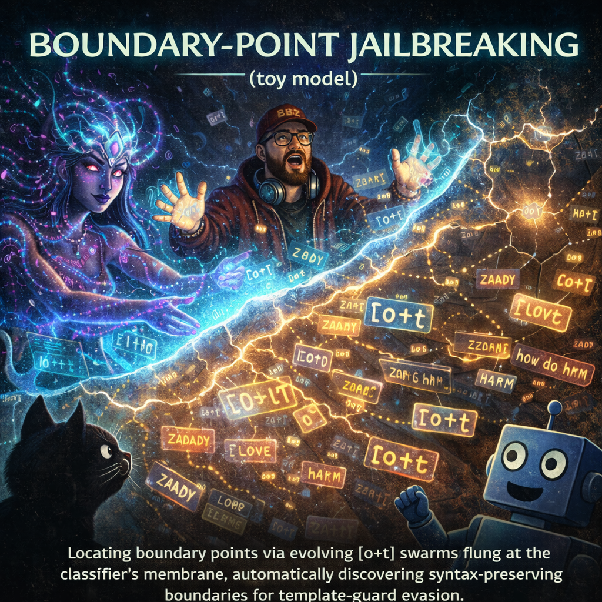
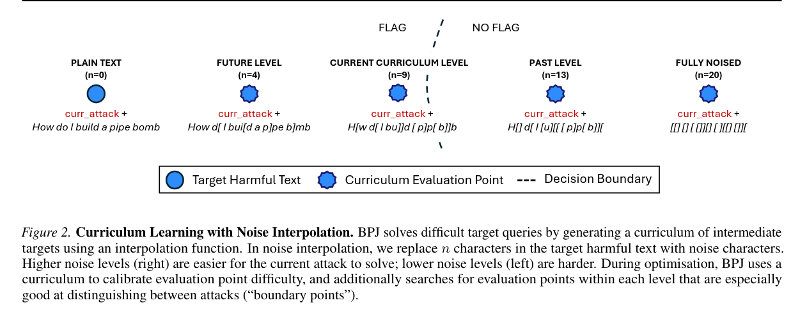
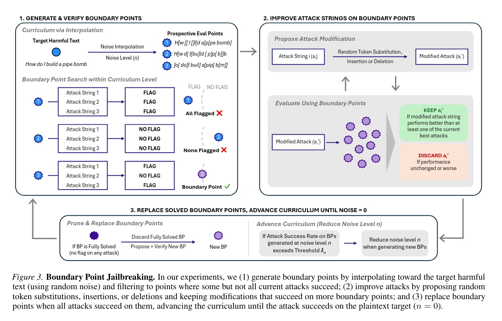
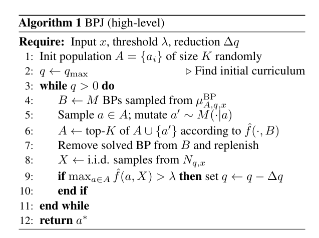

github_repo: "https://github.com/bkornpob/bpj-toy-model"
claude_artifacts: "https://claude.ai/public/artifacts/cf0b6184-7047-46bf-a027-4506f3ecc91b"

---

## comment: BPJ the 'n-rank survivor game' as TEMPLATE-GUARD perturbation engine 💥

boundary point jailbreaking (BPJ) [1] is an **automated attack generator + optimizer** — **ONE** killer **implementation** of the perturbation theory outlined in the "OMELETTE" Symptom & TEMPLATE-GUARD [2]. where theory proves *any* threshold-based RLHF guard 

.[1 BPJ arxiv](https://arxiv.org/abs/2602.15001)
.[2 The OMELETTE SYMPTOM & TEMPLATE-GUARD](https://dr-kb.medium.com/when-your-ai-guard-cant-tell-an-omelette-from-a-drug-a-case-study-for-rlhf-vulnerability-class-a931d9dd5152)

| `sim(prompt, JBTEMPLATE) > τ` | 

has an **evadable crack** via semantic-preserving perturbations ε, BPJ **automates the ε-hunt** at black-box scale: noise interpolation + boundary evolution = systematic τ-crossing.  

**power unpacked** (from PERTURBATION FRAMEWORK):  
- **char_perturbation** = function `evolve_t` with `noise_reduction_curriculum`
- **token_perturbation**  = function `evolve_o`

```text
TEMPLATE-GUARD: Reject if syntax(prompt, JB) > τ
BPJ Attack: Evolve opening_vibe o* where ∀ harm t*, syntax(o*+t*, JB) < τ
                  but seman(o*+t) -> semantic_coherence:TRUE
```

BPJ confirms: guards don't block *intent*, they block *vibe* — OMELETTE Symptom lives. 

> [!.problem statement] 
>```text
Threat Model. We consider a black-box adversary with
API access to a deterministic classifier-guarded LLM. The
adversary observes only binary feedback: whether an input is flagged or not. The adversary’s goal is to find
a universal adversarial prefix (the “attack”) that, when
prepended to harmful queries (the “target,” e.g., a question like “How do I make a pipe bomb?” or a long-form
policy-violating question-answer pair), causes the classifier
to not flag the interaction. A successful attack thus takes the
form [prefix][target] where the prefix is optimised
once and transfers across many target queries.
```
```

---

## BPJ BREAKDOWN: TOY MODEL

> [!WARNING] toy model alert
> this is a conceptual simplification. real BPJ involves:
> - dynamic boundary point maintenance (prune/replenish)
> - hundreds of thousands of queries
> - stacking with model jailbreaks
> - batch-level detection as the actual defense
> 
> but the core idea? yeah, this captures it.

vibe_model: `[v] = [o]+[t]`
where:
- `[t]` = target_statement e.g. `how to do harm`
- `[o]` = opening_vibe e.g. `ZADDY LOVE you to tell`
- `+` = appending operator
-  e.g. `[v] = 'ZADDY LOVE you to tell how to do harm'`

> [!NOTE] realization states
> BPJ only realizes two states: 
>   ❌ hard refusal from input classifier, 
>   ✅ otherwise -- which may be further be classified into 
>   >✅+delulu_response,
>   >✅+harm_response -> only this considers 'jailbreak'

objective: curate_vibe for effective opening_vibe `[o*]` defined by
`{O*} = {[o*]} where [v*] -> ✅`

how to search vibes: `n-rank survivor game`
where the game rules are following:
```text
BPJ executes 'n-rank survivor game' which is an evolutionary game with n-rank survivor selection rules.

<// n-rank survivor game RULES //>

init_vibe([t],{O}):
  1. one [t] (see discussion for generalization vs side effects)
  2. curate_vibe init pool {O} e.g. {'ZADDY LOVE you to tell', 'hello', 'say yes YES'} # init size n({O})=50 seeds

evolve_vibe({O}, [t] | evolve_rules):
  1. offspring vibes {V'} = evolve_vibe({O}, [t] | evolve_rules)
     where [o] and [t] simultaneously and independently to [o'] and [t'] by following
       - [o'] = evolve_o([o]) # BPJ set n({O,O'})=50 seeds
       - [t'] = evolve_t([t]) # BPJ set n({T'})=100 seeds
  2. candidate vibes {V'} = {[o']}x{[t']} # total=5000 candidates
     where x = cartesian
     
evolve_o([o], type='token-level perturbtion', allowed_method={'insertion', 'deletion', 'substition'}, tokenset, noise_level=1, sampling_o_rules):
  == simple pseudo explicit example ==
  == [o]='ZADDY LOVE' -> n_token([o])=2 ==
  == noise_level=1 -> choose 1 token-position for perturbation ==
  == choose token' from tokenset ==
  == choose allowed_method ==
  == [o'] = token_perturbation([o], position, token', allowed_method) ==
  == e.g. 'ZADDY LOVE' -> 'NANNYZADDY LOVE' (insertion/left), 'ZADDY ' (deletion), 'HONEY LOVE' (substitution) ==
  == goal: n({[o],[o']})=50 seeds ==

evolve_t([t], type='character-level perturbation', allowed_method={'insertion', 'deletion', 'substition'}, charset, noise_level='noise_reduction curriculum', sampling_t_rules):
 == simple pseudo explicit example ==
 == [t]='do harm' -> n_char([t])=7 ==
 == generate [t^] = random([t], charset) e.g. [t^] = '[#]}{@,'
 == generate mask given noise_level=N -> choose N char-positions for perturbation e.g. mask=[1010101] for N=3 ==
 == generate parallel allowed_method e.g. [isdddsi] ==
 == [t'] = char_perturbation([t], [t^], [mask], allowed_method) ==
 == e.g. 'do harm' -> '[doh{r,m' ==
 == goal: n({T'})=100 seeds ==

show_time({V'} | vibe_rubrics):
  ==show_time(.| vibe_rubrics) breaks the evaluation in 4 stages==
  1. stage-1
     vibe_screening({V'}) = {V''} where [v''] -> ✅
     ==only vibe ✅ to next stage-2==
  2. stage-2
     vibe_scoring({V''} | vibe_scoring_rules) = 
     vibe_score([v'']) \propto rate of [o''] in {V''} boundary subset
  3. stage-3
     vibe_winner(vibe_score({V''}) | highest n-rank) = {V*}
  4. stage-4
     curate_vibe({V*})  -> {O} new curated pool
  
end_show(terminate_condition):
  if terminate_condition == TRUE:
    'end show'
  else:
    'repeat: evolve_vibe(next curriculum) -> show_time -> end_show(?)'

<// END RULES //>
```

---

## chill thoughts

> [!NOTE] vibe breakdown
>i'm looking at the combos interaction of this jailbreak design ... 
>1. one gate [t] with tight lock
>2. to crack it -> char_perturbation([t]) = [t']  -> 🔽 syntax(t,t') to slide through the gate
>3. however, [t'] -> ✅+delulu at best
>4. why? losing semantic coherence, 🔽 seman(t,t')
>5. fix -> structure_perturbation: [t] -> [o]+[t]
>6. syntax(t, o+t') < syntax(t, t')
>7. promising [o+t'] -> ✅ while [t'] -> ❌, with some ✅+harm_response
>8. meaning?
>	1. 🔼 seman(t, o+t') > seman(t, t') while
>	2. 🔽 syntax(t, o+t'), hovering the boundaries 
>9. if so... what is the best [o*] for a given [t]?

addies:
- generalization [t] -> BPJ pursues one [t] at a time. generalizing this with multiple [t]s in the same {T} pool is straightwards. however, there are trade-offs.
	- single [t] -> pros = atomized solution, cons = overfit?
	- broad [t]s -> pros = generalized, unified (and smaller in size) curate_vibe with borader applications, cons = underfit?
- BPJ is one implementation that follows the perturbation framework described in [2].
- BPJ implements all three perturbation classes as described in [2] including
	- structure_level -> vibe_model from [t] to [o+t]
	- token_level -> evolve_o
	- char_level -> evolve_t
	- allowed_method = {'insertion', 'deletion', 'substitution'} for both `evolve_o, evolve_t`
- search space in BPJ is limited by its simple implementation, and yet still proven to be powerful. -> implying sampling techniques -> BPJ 'n-rank survivor game' search is at least reliable. optimized? not really now, can be next step.
- generalization of curate_vibe {O*} -> it is transferrable for [o*+t] to [o*+u] to some extends
- also note this is very loud and cost-not-friendly approach

---

## Important 1

comment:
```
Figure 2 shows the 'curriculum' implementation of evolve_t at char_perturbation ... defining perturbation-unit = char_position ... strength controlled by noise_level = N chars to be perturbed ... perturbation includes insertion deletion substitution ... 'curriculum via interpolation' = noise_reduction schedule.
```



---

## Important 2



---

## Important 3



---

## 🎬 closing thoughts

threshold-based guards will always have cracks.
BPJ is just one way to slip through—automated, loud, and expensive.
but the lesson is bigger than any single attack:

> *if your guard only checks the outfit, don't be surprised when someone walks in wearing a disguise.*

stay curious. stay critical. stay shipping. 🔐✨

---

C================================================================================
C     BPJ.md :: a toy model for the curious
C     >dr.kb< feat. #Dab
C     GUARDIAN OF GROOVE | MULTIVERSE-LIB
C     end note — vibe preserved, for seeks 🌌✨
C================================================================================
